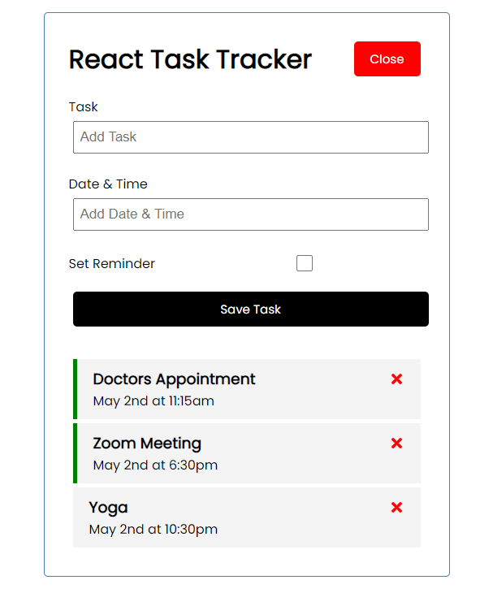

# Personal React Project

Simple Task Tracker

 

## Description: 

A Task Tracker built with React.js

  

## Table of Contents:

 

- [Deployed](#deployed)
- [Usage](#usage)
- [Credits](#credits)
- [License](#license)
- [Badges](#badges)
- [Features](#features)
- [How](#howtocontribute)
- [Tests](#tests)
- [Details](#details)
- [Github](#github)
- [URL](#url)
- [Author](#author)
- [Questions](#questions)

 

## Deployed
 
** Go to <a href="https://jasonjayoo.github.io/react-miniproject/" target="_blank">React Task Tracker</a> In order to view My React Task Tracker

 
 

## Usage: 

 

[Screenshot](./src/assets/Screenshot.png)  "Deployed Landing Page"

## Credits:

- Online tutorial was a great help in the development of this basic react application

 

## License:
 
    -  MIT License - Copyright (c) 2022 Jason Yoo
 
 

## Badges:
 
    - UCI Full Stack Bootcamp Graduate circa 2022
 
 

## Features:
    - Dynamic single page application built with React.js

## How to Contribute:
 
    - My github repository is publically viewable. If you would to contribute to the webpage please email me at my link on the webpage with you github username and I will add you as a contributor on the repo. 
 

## Github (Github Repository):

Click [here](https://github.com/jasonjayoo/react-miniproject) to go to my React Task Tracker Github Repository

 

## URL (Published Webpage):

<a href="https://jasonjayoo.github.io/react-miniproject/" target="_blank">My-React-Task-Tracker</a>

## Author:
                         Jason Yoo
  

## Questions:
  For any questions regarding this application, you may reach me directly at jasonjayoo@outlook.com.

  To view my other applications, please check out my github page [jasonjayoo](https://github.com/jasonjayoo).

